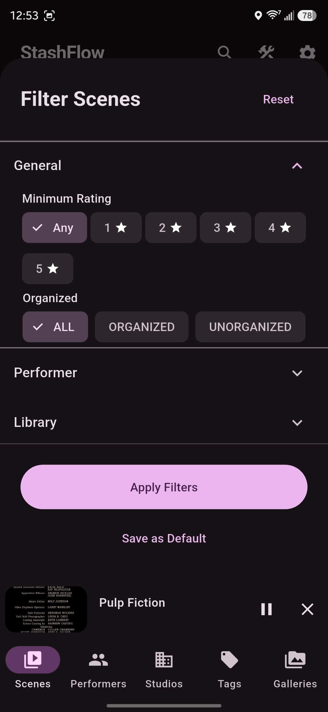
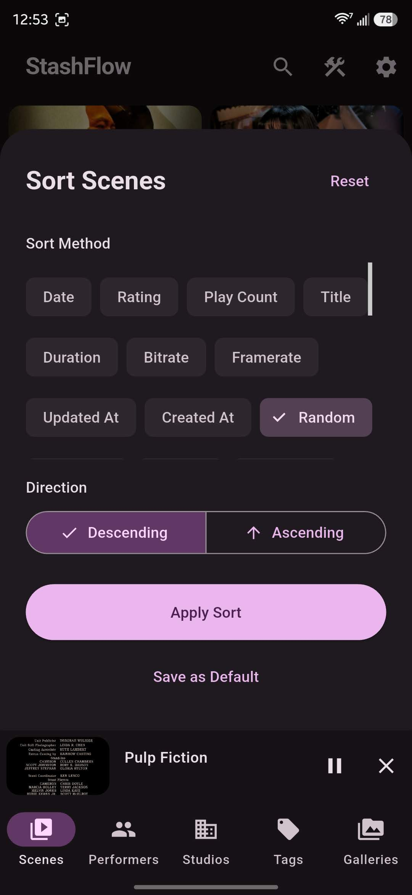
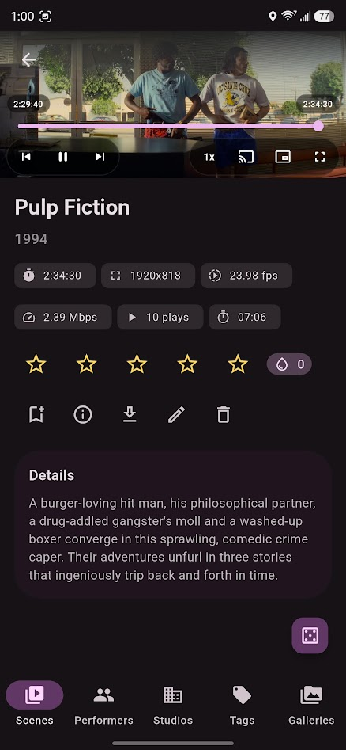
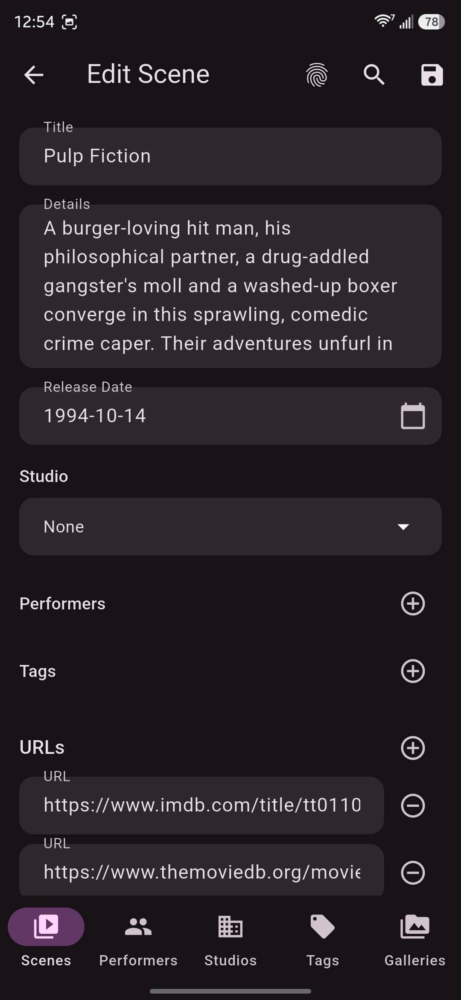
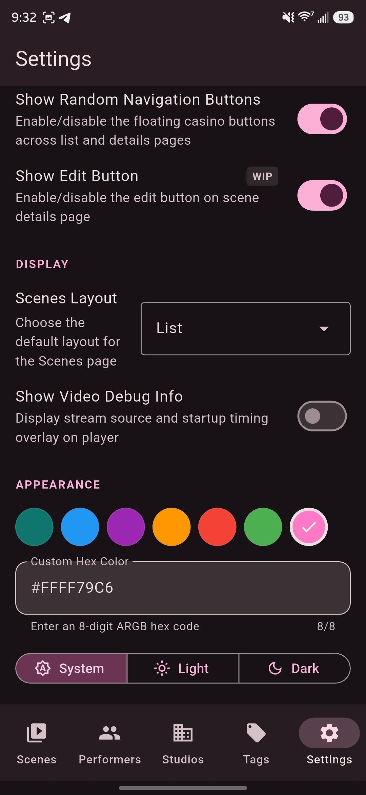

# 📱 StashFlow

### Your Stash library, everywhere

A modern, multi-platform client for your **Stash** server. Designed for seamless browsing, effortless discovery, and high-quality playback across **Android**, **Desktop** (Windows, macOS, Linux), and the [**Web**](https://alchemist-aloha.github.io/StashFlow/).

[](LICENSE)
[](pubspec.yaml)

## 📸 Screenshots

<p align="center">
 
 
 
</p>
<p align="center">
 
 
 
</p>

## ✨ Key Features

### 🌍 Multi-Platform Support

- 📱 **Android:** Full-featured mobile experience with PiP and background audio.
- 💻 **Desktop:** Native performance on Windows, macOS, and Linux with keyboard shortcuts and window management.
- 🌐 **Web:** Access your library from any modern browser without installation.

### 🧭 Interface & Navigation

- 📱 **Adaptive UI:** Responsive design that transitions from mobile-first layouts to expansive desktop views, including a side **Navigation Rail** and intelligent grids that scale up to 5+ columns.
- 📱 **Flexible Layouts:** Switch between **Grid/List** and **TikTok-style** vertical discovery layouts.
- 🎲 **Discovery Tools:** Use floating "Random" actions and "Surprise Me" entries to quickly explore your library.

### 🎬 Video Player & Subtitles

- 🎬 **Seamless Playback:** Native-feel player with multiple stream strategies, startup diagnostics, **Autoplay Next**, and queue continuity.
- 💬 **Subtitle Support:** Load external **VTT/SRT** subtitles automatically. Customize **font size** and **vertical position** to suit your device.
- 🌐 **Multi-Language:** Set a **default subtitle language** (English, Chinese, German, etc.) to auto-load whenever available.
- 🎵 **System Integration:** Supports `audio_service` controls (notifications/lock screen), background audio, and **Picture-in-Picture (PiP)**.
 - 🆕 **Improved Subtitle Handling:** External subtitles are auto-detected and loaded when available. Users can customize `subtitle_font_size` and `subtitle_position_bottom_ratio`, and set `default_subtitle_language` to prefer a language when multiple tracks exist.

### 🖼️ Images & Galleries

- 🖼️ **Media Libraries:** Browse high-resolution **Images** and **Galleries** with smooth animations and responsive layouts.
- 🖼️ **Enhanced Fullscreen Image Viewer:** Choose vertical/horizontal swipe direction, use previous/next quick-nav buttons, and avoid accidental UI hide when tapping overlay controls.
- ▶️ **Configurable Slideshow:** Start/stop slideshow, tune interval/transition/direction/loop, and save preferred defaults.
- ⭐ **Inline Rating Actions:** Rate either the current **Image** or its parent **Gallery** directly in fullscreen, with remembered rating target selection.
 - 🆕 **Sprite Image (Thumbnail Atlas) Support:** The app detects sprite metadata and uses thumbnail atlases for fast seek previews and compact gallery grids. Sprite parsing and rendering are handled during metadata resolution to provide smooth hover/seek preview UX.

### 🔎 Browsing, Search & Filters

- 👤 **Rich Browsing:** Explore Scenes, Images, Performers, Studios, Tags, Galleries, and Groups with fast pagination and global search.
- 🔍 **Advanced Filtering:** Use menu sorting (Date, Rating, Play Count, Random) and comprehensive multi-filter sheets.

### 🛠️ Editing & Metadata

- 🛠️ **Metadata Editor:** Update Scene **Title**, **Details**, **Date**, and **URLs** in a fullscreen editor.
- 🏷️ **Entity Association:** Assign **Studios**, **Performers**, and **Tags** from searchable pickers.
- 📡 **Smart Scraping:** Pull metadata from multiple scrape matches with **automatic merge** support for existing entities.

### ⚡ Reliability & Configuration

- ⚡ **Performance Optimized:** Includes **Image Deduplication**, prefetching, and automatic recovery from corrupt cache files for low-latency usage.
- 🛠️ **Native Customization:** Configure server connection, UI preferences, and streaming-related behaviors in one place.

## 🚀 Getting Started

### 📱 Android

1. **Download:** Grab the latest APK from the [Releases](https://github.com/Alchemist-Aloha/StashFlow/releases) page.
2. **Connect:** Open the app ➔ Settings ➔ Enter your **Server URL** and **API Key**.

### 💻 Desktop (Windows, macOS, Linux)

1. **Download:** Download the appropriate installer for your OS from the [Releases](https://github.com/Alchemist-Aloha/StashFlow/releases) page.
2. **Setup:** Install and launch ➔ Enter your **Server URL** and **API Key** in Settings.

### 🌐 Web

1. **Access:** Visit the [Live Web App](https://alchemist-aloha.github.io/StashFlow/) (if hosted) or host your own build.
2. **Configure:** Enter your Stash server details in the connection prompt. Enable local network access.

---

## 🤓 For Developers

### Tech Stack

- **Flutter** & **GoRouter**
- **Riverpod** & **Hooks** (State Management)
- **GraphQL** (`graphql_flutter` + `codegen`)
- **Video Player** + **Audio Service** (Native-feel playback)

### Project Structure

- `lib/core` shared infrastructure (theme, logs, providers)
- `lib/features/*` feature modules (domain/data/presentation)
- `graphql/` schema and GraphQL documents for code generation


### Build

Use the provided build script to check dependencies, generate code, and build for all available platforms:

```bash
chmod +x build.sh
./build.sh
# or on windows run:
./build.ps1
```

The script will:

1. **Check Dependencies:** Verify that `flutter`, `dart`, `cmake`, `ninja`, and the **Android SDK** are correctly installed.
2. **Fetch Packages:** Run `flutter pub get`.
3. **Generate Code:** Run `build_runner` for GraphQL and Riverpod.
4. **Multi-Platform Build:** Attempt to build for **Android (APK)**, **Web**, **Linux**, **Windows**, and **macOS**, providing a summary of successes and failures at the end.

Or you can build the project manually for a specific platform:

```bash
# Get dependencies
flutter pub get

# Regenerate code (GraphQL & Notifiers)
dart run build_runner build --delete-conflicting-outputs

# Build flutter app
flutter build apk --release --split-per-abi
flutter build windows --release
flutter build linux --release
```

## 📚 Internal Docs

For more info, see:
- [Project wiki page](https://github.com/Alchemist-Aloha/StashFlow/wiki)
